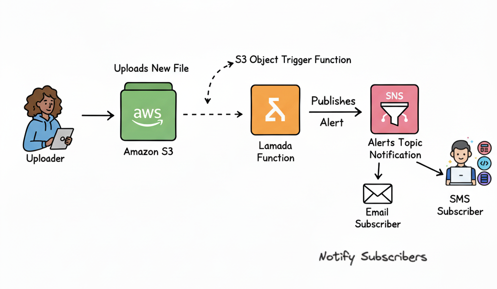

# 🚀 S3 Event-Driven Notifications with SNS and Lambda  

This project demonstrates how to build an **event-driven architecture** on AWS using **Amazon S3**, **AWS Lambda**, and **Amazon SNS**.  
Whenever a file is uploaded to an S3 bucket, a Lambda function is triggered, which then sends a notification message to an SNS topic.  
This is ideal for automated alerts, workflows, or real-time monitoring.  

## 🏗️ **Architecture Overview**  

## ⚙️ **AWS Services Used**  

| Service | Purpose |
|---------|---------|
| **Amazon S3** | Stores uploaded files and triggers the Lambda function |
| **AWS Lambda** | Processes S3 event and sends notification to SNS |
| **Amazon SNS** | Sends notifications to subscribed endpoints (Email, SMS, Lambda, HTTP) |

## 📝 **Implementation Steps**  

Follow these steps to deploy the solution:

### 1. **Create an SNS Topic**  
- Go to AWS Console → SNS → Topics → Create Topic  
- Copy the Topic ARN for later use  

### 2. **Create an S3 Bucket**  
- Go to AWS Console → S3 → Create Bucket  
- Enable event notifications for object creation (upload)  
- Point the notification to trigger your Lambda function  

### 3. **Create a Lambda Function**  
- Go to AWS Console → Lambda → Create Function  
- Runtime: **Node.js 18.x**  
- Upload your `index.js` file with the code  
- Set the Handler as `index.handler`  
- Add environment variables if needed (e.g., Topic ARN, Region)  

### 4. **Add Permissions to Lambda**  
- Attach an IAM policy to Lambda allowing `sns:Publish` to your topic  

### 5. **Deploy and Test**  
- Upload a file to your S3 bucket  
- Check your email/SMS/endpoint subscribed to the SNS topic for notifications  

## 📂 **Project Structure**  

├── index.js # Lambda function (Node.js code)  
├── README.md # Documentation    
├── Architecture # Architecture diagram
